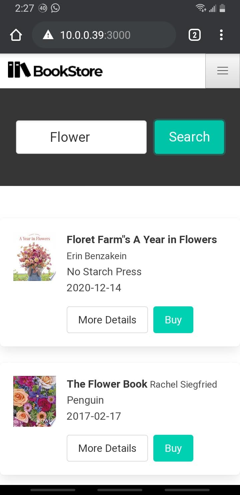
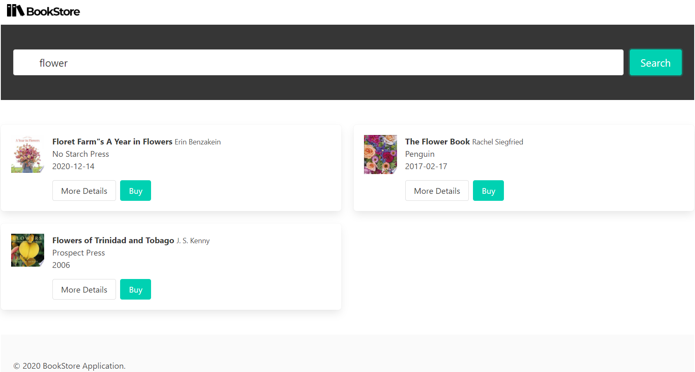
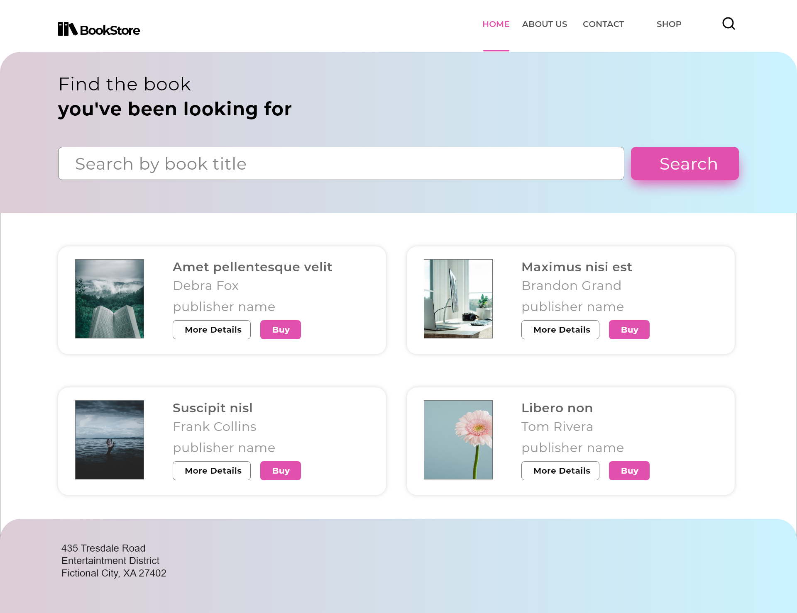

This is a basic ReactJS web application that allows to search and list the details of books using a REST API.

This project was bootstrapped with [Create React App](https://github.com/facebook/create-react-app), 
uses the https://bulma.io/ CSS Framework and  consumes the REST API at: https://github.com/midhunhk/sample-rest-api

This Single Page Application (SPA) accomplishes the following items

1. Search Component
2. Hit REST API to fetch search results
3. Display search results in a grid with Cards
4. Display more details of an item in a separate page
5. Back to reults link

### `npm start`

Runs the app in the development mode. 
Open [http://localhost:3000](http://localhost:3000) to view it in the browser.

### Screenshots
Bulma is very easy to use and supports responsive design out of the box.

#### On Mobile
 

#### On Desktop

### Design Concept
The application is visualized in the below concept.

